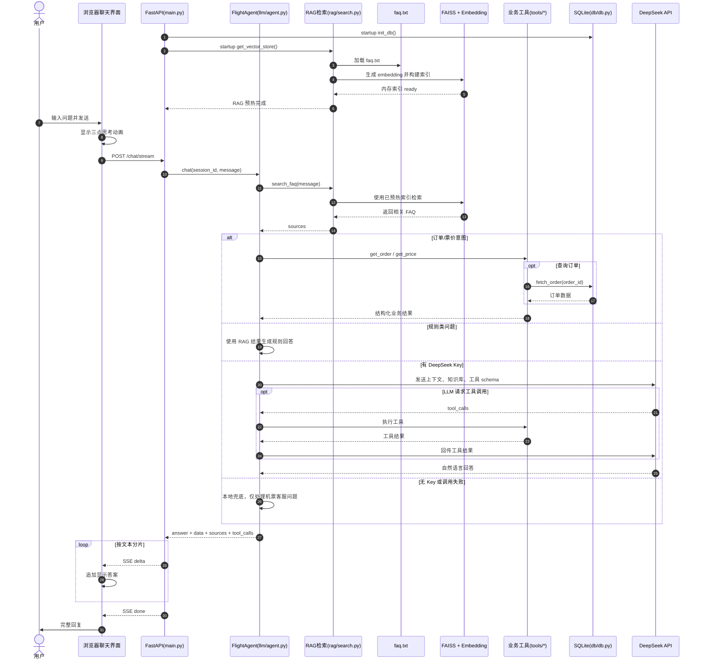
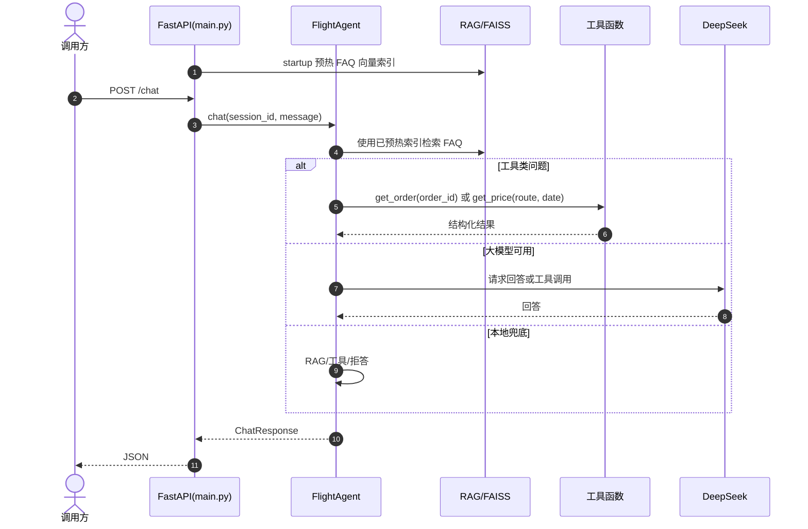

# 机票 AI 客服系统时序图

## 流式聊天主流程

```mermaid
sequenceDiagram
    autonumber
    actor User as 用户
    participant Browser as 浏览器聊天界面
    participant API as FastAPI(main.py)
    participant Agent as FlightAgent(llm/agent.py)
    participant RAG as RAG检索(rag/search.py)
    participant FAQ as faq.txt
    participant FAISS as FAISS + Embedding
    participant Tool as 业务工具(tools/*)
    participant DB as SQLite(db/db.py)
    participant LLM as DeepSeek API

    API->>DB: startup init_db()
    API->>RAG: startup get_vector_store()
    RAG->>FAQ: 加载 faq.txt
    RAG->>FAISS: 生成 embedding 并构建索引
    FAISS-->>RAG: 内存索引 ready
    RAG-->>API: RAG 预热完成

    User->>Browser: 输入问题并发送
    Browser->>Browser: 显示三点思考动画
    Browser->>API: POST /chat/stream
    API->>Agent: chat(session_id, message)
    Agent->>RAG: search_faq(message)
    RAG->>FAISS: 使用已预热索引检索
    FAISS-->>RAG: 返回相关 FAQ
    RAG-->>Agent: sources

    alt 订单/票价意图
        Agent->>Tool: get_order / get_price
        opt 查询订单
            Tool->>DB: fetch_order(order_id)
            DB-->>Tool: 订单数据
        end
        Tool-->>Agent: 结构化业务结果
    else 规则类问题
        Agent->>Agent: 使用 RAG 结果生成规则回答
    else 有 DeepSeek Key
        Agent->>LLM: 发送上下文、知识库、工具 schema
        opt LLM 请求工具调用
            LLM-->>Agent: tool_calls
            Agent->>Tool: 执行工具
            Tool-->>Agent: 工具结果
            Agent->>LLM: 回传工具结果
        end
        LLM-->>Agent: 自然语言回答
    else 无 Key 或调用失败
        Agent->>Agent: 本地兜底，仅处理机票客服问题
    end

    Agent-->>API: answer + data + sources + tool_calls
    loop 按文本分片
        API-->>Browser: SSE delta
        Browser->>Browser: 追加显示答案
    end
    API-->>Browser: SSE done
    Browser->>User: 完整回复
```

## 普通聊天接口

```mermaid
sequenceDiagram
    autonumber
    actor Client as 调用方
    participant API as FastAPI(main.py)
    participant Agent as FlightAgent
    participant RAG as RAG/FAISS
    participant Tool as 工具函数
    participant LLM as DeepSeek

    API->>RAG: startup 预热 FAQ 向量索引
    Client->>API: POST /chat
    API->>Agent: chat(session_id, message)
    Agent->>RAG: 使用已预热索引检索 FAQ
    alt 工具类问题
        Agent->>Tool: get_order(order_id) 或 get_price(route, date)
        Tool-->>Agent: 结构化结果
    else 大模型可用
        Agent->>LLM: 请求回答或工具调用
        LLM-->>Agent: 回答
    else 本地兜底
        Agent->>Agent: RAG/工具/拒答
    end
    Agent-->>API: ChatResponse
    API-->>Client: JSON
```
